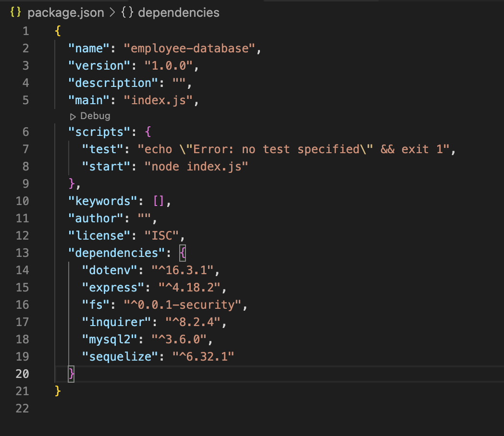

# Employee Database

## Description

This project serves as a robust employee management system, catering to the needs of company owners and managers. By utilizing a SQL database to store and organize employee data, it ensures data security with personalized login credentials. Users can conveniently interact with their employee database through an intuitive console interface, aided by the visual clarity of console.table. From adding and updating employees and roles to calculating departmental budgets, this system provides a comprehensive solution for efficient employee data management while maintaining data integrity through enforced relationships between tables.

## Table of Contents 

- [Installation](#installation)
- [Usage](#usage)
- [Credits](#credits)
- [License](#license)
- [Badges](#badges)
- [Tests](#tests)
- [Questions](#questions)

## Installation

In order to get the environment to run, the user will need to install six packages: fs, express, dotenv, inquirer, mysql2, and sequelize. Please ensure that version 4.18.4 of express is installed, version 8.2.4 of inquirer, version 3.6.0 of mysql and version 6.32.1 of sequelize are all installed. Importantly the user will need to begin with the command `npm init`, followed by `npm install express@4.18.4`, `npm install inquirer@8.2.4`, `npm install mysql2@3.6.0`, and `npm install sequelize@6.32.1`. 

## Usage

The user will need to setup their `.env` file which will contain DB_USER, DB_PASSWORD, and DB_NAME. Please ensure DB_USER is set to "root," allowing the user to access and manage the SQL database efficiently. Additionally, configuration of the database connection parameters in the project is crucial to ensure seamless functionality. DB_PASSWORD will need to be the password associated with the mysql account. 

After this setup, the user will need to change directories into the `db` folder and type in the following: `mysql -u root -p`. The user will then be prompted to type in the associated password. Next, type in `SOURCE schema.sql;` to setup the `employee_db` for the repository. If the user wants to see an example of how the database works, the user can additionally input `SOURCE seeds.sql;` to pre-load some data into the database.

Once completed, the user will then be able to do `npm start` and begin navigating the newly-created employee database.

[Tutorial](https://watch.screencastify.com/v/xSogs9P4Az1uhCkN2Cuf)

## Credits

David Montoto

## License

[Unlicensed](LICENSE)

## Badges

## Tests

N/A